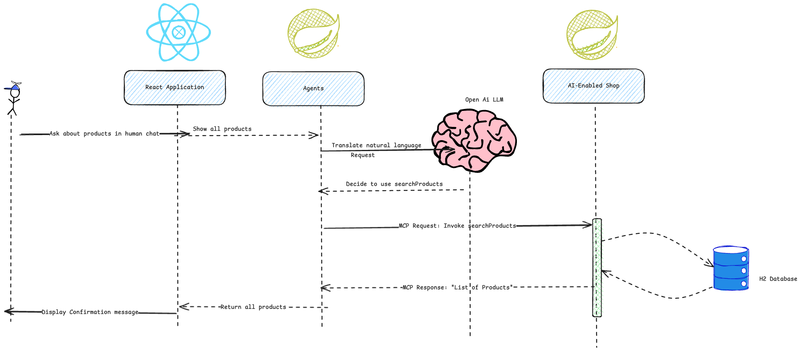

# ZeniMarketplaceAgent

Flow of the project!

# Spring AI - Lab Instructions

Prerequisites: before starting this course, you should have the following installed:

Java Development Kit (ideally version 21 or later)
Maven (version 3.8.6 or later)
Node.js (version 18 or later)

An IDE such as IntelliJ Community Edition or Ultimate Edition (ideally the latest version)

an OpenAI API KEY to get [here](https://ctxt.io/2/AAD4sM0fFA)

General guideline

This lab guide relies on the examples seen in the [slides] (https://docs.google.com/presentation/d/1CQWzOuEiAtB-MH2s0J-Ve3MMRM3ufU5kllTh6QBJ1tg/edit?slide=id.g36c85143bec_0_0#slide=id.g36c85143bec_0_0).
In order to have all the information you need, you should have the lab instructions and the slides side by side, so you can refer to the examples seen in the slides at any time.


## Table of Contents

1. [Setting up Spring AI with OpenAI](#setting-up-spring-ai-with-openai)
   - [Setting up your Spring AI project](#11-setting-up-your-spring-ai-project)
   - [application.properties configuration](#12-applicationproperties-configuration)
   - [Running your first JUnit test](#13-running-your-first-junit-test)
2. [Using the ChatClient](#using-the-chatclient)
   - [Using the ChatClient to setup a seller Marketplace Agent](#21-using-the-chatclient-to-setup-a-seller-marketplace-agent)
3. [Chat Memory](#3-chat-memory)
   - [Using chat memory to keep track of the conversation](#31-using-chat-memory-to-keep-track-of-the-conversation)
4. [UI](#4-ui)
   - [Setup a UI to discuss with the seller agent](#41-setup-an-ui-to-discuss-with-the-seller-agent)
5. [MCP](#5-mcp)
   - [Retrieve information using MCP](#51-retrieve-information-using-mcp)
6. [Search Product](#6-search-product)
   - [Add a MCP tool to be able to search product](#61-add-a-mcp-tools-to-be-able-to-search-product)
7. [User Management Agent and Router Agent](#7-user-management-agent-and-router-agent)
   - [Add a user Agent to manage the user requests](#71-add-a-user-agent-to-manage-the-user-requests)
8. [Negotiating Agent](#8-negotiating-agent)
   - [Update the seller agent to negotiate the selling of a product](#81-update-the-seller-agent-to-negotiate-the-selling-of-a-product)
9. [Order Management Agent](#9-order-management-agent)
   - [Create an Order Management Agent](#91-create-an-order-management-agent)
10. [RAG using Vector Database](#10-rag-using-vector-database)
    - [Create an agent to load terms and conditions from a vector in-memory database](#101-create-an-agent-to-load-term-and-conditions-from-a-vector-in-memory-database)
---

### 1. Setting up Spring AI with OpenAI

Our first goal is to install the Spring AI dependencies and write a simple API call to an LLM (ChatGPT will be used as an example)

#### 1.1 Setting up your Spring AI project
- Make sure you have Java version 21 installed.
- Install the dependencies using `mvn clean install -DskipTests`

If you don't have installed IntelliJ and Java 21 you can use this online environment for this HandsOn [OnlineIDE](https://replit.com/@puls972/SpringAiHandsOn)
- Create a new account (Free)
- Fork the project
- Access the shell
- Install the dependencies using `mvn clean install -DskipTests`

#### 1.2 application.properties configuration
-Specify `gpt-4o` as the OpenAI model to be used in the parameter `spring.ai.openai.chat.options.model`

As seen in the slides, it is not a best practice to store an API key inside [application.properties](handson/src/main/resources/application.properties) because it would be stored on git.
Instead, it should use the ${OPENAI_API_KEY} syntax in order to refer to an environment variable.
You do not need to setup the environment variable at this stage, as it will be later setup inside your JUnit test

#### 1.3 Running your first JUnit test
- In `src/main/test`, update the [HandsonApplicationTests](handson/src/test/java/com/zenika/handson/HandsonApplicationTests.java) class:
  ```java
  @SpringBootTest
  class ApplicationTests {

      @Value("${spring.ai.openai.api-key}")
      private String apiKey;

      @Test
      void contextLoads() {
          assertThat(apiKey).isNotEmpty();
      }
  }
  ```
- As seen in the slides, update your JUnit test configuration so it properly sets the value for the environment variable OPENAI_API_KEY, you can get the key [here]( https://ctxt.io/2/AAB4vv0pEA) (not required for online IDE)
- Run your test to verify setup.
- (To run the test for the online IDE execute in the shell `mvn -Dtest=ApplicationTests test` )
- Check your [application.properties](handson/src/main/resources/application.properties) file, the `spring.ai.openai.api-key` property should be set to `${OPENAI_API_KEY}`.
- Check your [pom.xml](handson/pom.xml) file, the `spring-ai-starter-model-openai` dependency should be present.

### 2. Using the ChatClient

#### 2.1 Using the ChatClient to setup a seller Marketplace Agent
1. Update the class [AgentConfiguration](handson/src/main/java/com/zenika/handson/configuration/AgentConfiguration.java)  in `com.zenika.handson.configuration`.

   As its name says, it is a Spring Configuration and should be annotated with the `@Configuration` stereotype annotation

2. Initialize the `@Bean chatClient` with the name `sellerAgentChatClient` in the [AgentConfiguration](handson/src/main/java/com/zenika/handson/configuration/AgentConfiguration.java)
  ```java
@Bean
ChatClient sellerAgentChatClient(ChatClient.Builder chatClientBuilder) {
    /**
     * Create a ChatClient instance for the seller agent.
     * This client will be used to interact with the OpenAI API.
     */
}
  ```
Set the `defaultSystem` prompt to `GENERAL_MARKET_PLACE_PROMPT` constant localized in [PromptContants](handson/src/main/java/com/zenika/handson/constant/PromptContants.java).

3. Inside [PromptContants](handson/src/main/java/com/zenika/handson/constant/PromptContants.java), Fill up the variable `GENERAL_MARKET_PLACE_PROMPT`, with a guideline for the chat client to be a marketplace named "Zeni Marketplace" who sell products to customer. The prompt should be similar to the one below:
  ```java
public static final String GENERAL_MARKET_PLACE_PROMPT = """
    You are a helpful assistant in a market place named ZeniMarket.
        Your role is to politely assist users about their inquiries related to products, orders, and general information about the market place.
    """;
  ```
try to do it by yourself.

4. Update a JUnit test [SellerAgentTests](handson/src/test/java/com/zenika/handson/agents/seller/SellerAgentTests.java) complete the methode `sellerAgentCanCommunicate` and make sure the test is passing.

### 3. Chat Memory

#### 3.1 Using chat memory to keep track of the conversation
1. Run the JUnit test [SellerAgentTests](handson/src/test/java/com/zenika/handson/agents/seller/SellerAgentTests.java) `sellerAgentChatMemory` test
   Why is it failing? What is the problem?
2. Update the [AgentConfiguration](handson/src/main/java/com/zenika/handson/configuration/AgentConfiguration.java) to add a `@Bean` called `defaultChatMemoryAdvisor` that will be used to store the conversation history.
```java
    @Bean
    PromptChatMemoryAdvisor defaultChatMemoryAdvisor(...) {
        /**
         * Create a PromptChatMemoryAdvisor instance that will be used to store the conversation history.
         * This advisor will be used by the ChatClient to keep track of the conversation.
         */
        
    }
```
3. Update the [AgentConfiguration](handson/src/main/java/com/zenika/handson/configuration/AgentConfiguration.java) to inject the `defaultChatMemoryAdvisor` into the `sellerAgentChatClient` bean.

4. Run the JUnit test [SellerAgentTests](handson/src/test/java/com/zenika/handson/agents/seller/SellerAgentTests.java) `sellerAgentChatMemory` test again and check if the test is passing now.

#### 4 UI
#### 4.1 Setup an UI to discuss with the seller agent
1. In the [AiMarketPlaceController](handson/src/main/java/com/zenika/handson/controllers/AiMarketPlaceController.java) define a new endpoint `/api/marketplace/chat` that will be used to communicate with the seller agent.
   - Define those two records in the controller:
```java
record ChatRequest(String message, String user) {}
record ChatResponse(String response) {}
```
   - The endpoint should accept a POST request with a JSON body containing a `ChatRequest` field.
   - The endpoint should return a JSON response containing a `ChatResponse` field.
```java
@CrossOrigin(origins = {"http://localhost:3000", "http://127.0.0.1:3000"})
@PostMapping("/chat")
public ChatResponse generate(@RequestBody ...) {
    /**
     * This method will be used to communicate with the seller agent.
     * It will use the ChatClient to send the message and return the response.
     */
  ...
  return new ChatResponse(response);
}
```
  - Inject the `sellerAgentChatClient` into the controller and use it to send the message to the agent.
2. Install and run the UI located in [e-commerce-chat-ui] (e-commerce-chat-ui) folder.
   - If you are running it locally, make sure to run it in a separate terminal window.
   - You can use the command `npm install` to install the dependencies and `npm start` to run the UI.
   - It will be running on port 3000 by default.

#### 5 MCP
#### 5.1 Retrieve information using MCP
If you did not complete the section 3.1, please checkout the branch : `solution_4` to see the solution.
1. Using the UI or a curl command, ask to your agent to list the products available in the marketplace.
   - What is the response? Is it what you expected?
   If you are not using the UI you can use the following curl command:
   - ```bash
     curl -X POST http://localhost:8080/api/marketplace/chat \
     -H "Content-Type: application/json" \
     -d '{"message": "List the products available in the marketplace", "user": "test"}'
     ```
2. We'll be now having a look at the MCP serveur project, which is located in the [McpApplication](mcp_server) folder.
   Open the [McpApplication](mcp_server) and check the following file: 
   - The configuration file [application.properties](mcp_server/src/main/resources/application.properties), what is the MCP server port? What is the MCP server endpoint ? is the MCP server sync or async ?  What is this option used for `spring.ai.mcp.server.stdio.enabled=true`?
   - The Pom file [pom.xml](mcp_server/pom.xml),  Find and identify what is the `spring-ai-mcp-server` dependency used for ?
   - Check the Product repository [ProductRepository](mcp_server/src/main/java/com/zenika/mcp_server/repository/ProductRepository.java), the data available in the [data.sql](mcp_server/src/main/resources/data.sql) file and the schema in the [schema.sql](mcp_server/src/main/resources/schema.sql). What are the products available in the marketplace?
   - Check the [StoreService](mcp_server/src/main/java/com/zenika/mcp_server/service/StoreService.java) class, what is the purpose of this class? What are the methods available in this class?

[//]: # (   - Run the JUnit test [StoreServiceTests]&#40;mcp_server/src/test/java/com/zenika/mcp_server/service/StoreServiceTests.java&#41; `getAllProducts` and check if the test is passing.)

[//]: # (     - What is the purpose of this test? What does it test?)

[//]: # (     - If the test is failing, what is the problem? How can you fix it?)
3. Now we want to expose the products available in the marketplace using a MCP tool.
   - Define a new Tool in [StoreTools](mcp_server/src/main/java/com/zenika/mcp_server/config/StoreTools.java) to return the list of all products available in the marketplace.
   - The method should be annotated with `@Tool` and should return a `ProductResponseList`.
   - The method should use the `StoreService` to retrieve the products from the database.
   - The `@Tool` annotation should have the following parameters:
     - `name` provide a meaningful name for the tool, for example `getAllItems`
     - `description` provide a meaningful description for the tool

   Why is it important to provide a meaningful name and description for the tool?
4. Update the [McpServerApplication.java](mcp_server/src/main/java/com/zenika/mcp_server/McpServerApplication.java) to expose the `StoreTools` on the MCP server.
  ```java
   	@Bean
	public ToolCallbackProvider tools(StoreTools sellerAccountTools) {
		return ... // Use the StoreTools to create a ToolCallbackProvider
}
```
   - Run the Junit Test [McpServerApplicationTests](mcp_server/src/test/java/com/zenika/mcp_server/McpServerApplicationTests.java) `contextLoads` and check if the test is passing.

5. Back on the Agent project,Update the [AgentConfiguration](handson/src/main/java/com/zenika/handson/configuration/AgentConfiguration.java) to inject the `ToolCallbackProvider toolCallbackProvider` into the `sellerAgentChatClient` bean.
   - Go into the application.properties file and set the following properties:
     - `spring.ai.mcp.client.sse.connections.account-mcp-server.url` Set the URL to the MCP server following the configuration in the [application.properties](mcp_server/src/main/resources/application.properties) file
     - `spring.ai.mcp.client.type` Set the type value following the configuration in the [application.properties](mcp_server/src/main/resources/application.properties) file
     - `spring.ai.mcp.server.stdio.port` Set the port to the MCP server following the configuration in the [application.properties](mcp_server/src/main/resources/application.properties) file
     - `spring.ai.mcp.client.request-timeout` Set the request timeout to 30 seconds, this is the time the agent will wait for a response from the MCP server before timing out.
   
6. Run the MPC server using the command `mvn spring-boot:run` from the `mcp_server` folder.
   - If you are using the online IDE, you can run the MCP server by clicking on the "Run" button in the IDE.
   - If you are running it locally, make sure to run it in a separate terminal window.
7. Back on the Agent project, Using the UI or a curl command, ask to your agent to list the products available in the marketplace.
    - What is the response? Is it what you expected?
      If you are not using the UI you can use the following curl command:
   - ```bash
     curl -X POST http://localhost:8080/api/marketplace/chat \
     -H "Content-Type: application/json" \
     -d '{"message": "List the products available in the marketplace", "user": "test"}'
     ```
     What is the response ?
     How spring AI is able to call the MCP server and retrieve the list of products ?
   
8. Run the JUnit test [SellerAgentTests](handson/src/test/java/com/zenika/handson/agents/seller/SellerAgentTests.java) `getAllProduct` and check if the test is passing.

#### 6 Search product 
#### 6.1 Add a MCP tools to be able to search product 


1. Define a new Tool in [StoreTools](mcp_server/src/main/java/com/zenika/mcp_server/config/StoreTools.java) to search a specific product base on user request.
    - Before defining the tool, check the method searchProducts in [StoreService](mcp_server/src/main/java/com/zenika/mcp_server/service/StoreService.java) class.
    - The method should be annotated with `@Tool` and should return a `ProductResponseList`.
    - The method should use the `StoreService` to search the products from the database.
    - The `@Tool` annotation should have the following parameters:
        - `name` provide a meaningful name for the tool, for example `searchProducts`
        - `description` provide a meaningful description for the tool, for example `Search for products in the store catalog based on a natural language query. including their ID, name, price, and stock and other details`
2. Execute the Junit test `getLaptopProduct` in [SellerAgentTests](handson/src/test/java/com/zenika/handson/agents/seller/SellerAgentTests.java) and check if the test is passing.

#### 7 User management Agent And Router agent
#### 7.1 Add a user Agent to manage the user requests
We now have an agent that can communicate with the MCP server and retrieve the list of products available in the marketplace.

But we want more, what about an agent that can manage the user requests, like getting the user information.

1. Why do we need a user agent ? Why just not use the seller agent to manage the user requests ?
2. What will be the problem if we have multiple agents with our current implementation ? And what is the pattern to follow in order to avoid this problem ?
3. Let's have a look at [PromptBeanService](handson/src/main/java/com/zenika/handson/services/PromptBeanService.java) class.
   - Can you explain what is `DefaultListableBeanFactory` in Spring ? 
   - Can you explain the function `getBeanDefinitionDescription` ?.
   - Can you explain the function `getAllBeansDefinitionDescriptions` ?
4. If the section 6.3 is understood let's create an agent that will manage the other agent :
   1. Inside [AgentService](handson/src/main/java/com/zenika/handson/services/AgentService.java), add the variable `private final Map<String, ChatClient> chatClientMap;` and initialize it in the constructor using spring injection.
      - What is the purpose of this variable ? and what will be the contents of this variable injected by Spring ?
   2. Inside [AgentService](handson/src/main/java/com/zenika/handson/services/AgentService.java), add the variable `private final ChatClient routerChatClient;` but do not initialize it yet.
   3. Inside [AgentConfiguration](handson/src/main/java/com/zenika/handson/configuration/AgentConfiguration.java), inject in the constructor the chatClient builder `ChatClient.Builder chatClientBuilder`
   4. Inside [PromptContants](handson/src/main/java/com/zenika/handson/constant/PromptContants.java). define the constant `ROUTER_AGENT_PROMPT` with a prompt that:
        - Check on the Agent description to chose which agent to use following the user inquiry.
        - Mention that only the name of the agent should be returned in the response
        - Here is an example of a prompt you can use, but try to do it by yourself:
        ```java
            public static final String ROUTER_PROMPT = """
                You are a router. When a request comes in, inspect the request and determine which of the following categories best matches the nature of the request and then return the category, and only the category of the best match. Here is a description of each category and an explanation of why you might choose that category.
                """;
        ```
   5. Inside [AgentService](handson/src/main/java/com/zenika/handson/services/AgentService.java) constructor, create a string `systemRouterPrompt` containing :
      - The `ROUTER_PROMPT` constant defined in the previous step.
      - Concatenate with the description of all the agents available in the `chatClientMap` variable using the promptBeanService.
      - ```java
            // Build the system prompt for the router chat client
            String systemRouterPrompt = ROUTER_PROMPT + this.promptBeanService.getAllBeansDefinitionDescriptions(...);
        ```
   6. [AgentService](handson/src/main/java/com/zenika/handson/services/AgentService.java) , initialize `routerChatClient` using `chatClientBuilder` with a `defaultSystem` equal to `systemRouterPrompt`.
   7. Now we have a router agent that can route the requests to the appropriate agent, but our current agent do not have description, let's add a description to the seller agent.
      - Inside [AgentConfiguration](handson/src/main/java/com/zenika/handson/configuration/AgentConfiguration.java), add a `@Description` on the `sellerAgentDescription` that will be used to describe the seller agent.
      - The description should be similar to the one below but try to do it by yourself:
      ```java
        @Bean
        @Description("This Chat should be use to handle inquiries about listing products, retrieving product details, and reply about product information.")
        ChatClient sellerAgentChatClient(...)
      ```
   8. Uncomment the function `routeInquiry` and `getChatClient` inside [AgentService](handson/src/main/java/com/zenika/handson/services/AgentService.java), remove the return null value.
        - What is the function of `routeInquiry` ? execute the JUnit test [AgentServiceTests](handson/src/test/java/com/zenika/handson/agents/AgentServiceTests.java) `getTheSellerAgentForProductInquiry` and check if the test is passing.
        - What is the function if `getChatClient`? execute the JUnit test [AgentServiceTests](handson/src/test/java/com/zenika/handson/agents/AgentServiceTests.java) `sellerAgentIsPartOfAgentMap` and check if the test is passing.
   9. Now let's update our router to use the `routerChatClient` to route the inquiries to the appropriate agent.
      - Inside [AiMarketPlaceController](handson/src/main/java/com/zenika/handson/controllers/AiMarketPlaceController.java), update the controller as following
      - ```java
        @PostMapping("/chat")
        public ChatResponse generate(@RequestBody ChatRequest chatRequest) {
            // Use the AgentService to get the appropriate agent name from the inquiry
            var resolvedChatClient = ...;
            var agentClient = this.agentService.getChatClient(resolvedChatClient);
            String response =  agentClient
                .prompt()
                .user(...) // Complete with user inquiry
                .system(...) // Complete with system prompt concatenated with the current chat prompt using `promptBeanService.getBeanDefinitionDescription`
                .advisors(a -> a.param(ChatMemory.CONVERSATION_ID, chatRequest.user()))
                .call()
                .content();
            return new ChatResponse(response);
        }
        ```
     10. Explain the following:
        - `.advisors(a -> a.param(ChatMemory.CONVERSATION_ID, chatRequest.user()))` what is this line used for ?
        - Why do we have to set the system prompt at each call ? even if we already set it in our chatClient here [AgentConfiguration](handson/src/main/java/com/zenika/handson/configuration/AgentConfiguration.java).
   
5. Let's create an agent that will manage the user requests.
   - Inside [AgentConfiguration](handson/src/main/java/com/zenika/handson/configuration/AgentConfiguration.java) add a new `@Bean` called `userManagementChatClient` that will be used to manage the user related requests.
   - ```java
            @Bean
            @Description("""This Chat should be use to handle User management.This Chat should be able to handle inquiries about creating a new user, 
            updating an existing user.This Chat can add or update users in the database.Validate if user exists in database by given id""")
            ChatClient userManagementChatClient(ChatClient.Builder chatClientBuilder, ...) {
                /**
                 * Create a ChatClient instance for the user management agent.
                 * This client will be used to interact with the OpenAI API.
                 */
                 chatClientBuilder
                .defaultSystem(GENERAL_MARKET_PLACE_PROMPT)
                .defaultToolCallbacks(...)
                .defaultAdvisors(...)
                .build();
            }
        ```
   - Inside the MPC project let's add the tool to handle users [StoreTools](mcp_server/src/main/java/com/zenika/mcp_server/config/StoreTools.java)
     1. Create a Tool get a user info base on it's id, do check [data.sql](mcp_server/src/main/resources/data.sql) to see the user available in the database.
        - Before defining the tool, check the method `getUserById` in [StoreService](mcp_server/src/main/java/com/zenika/mcp_server/service/StoreService.java) class.
        - Check UserRepository in [UserRepository](mcp_server/src/main/java/com/zenika/mcp_server/repository/UserRepository.java) to retrieve the user from the database.
        - Check the `UserResponse` class in [UserResponse](mcp_server/src/main/java/com/zenika/mcp_server/model/UserResponse.java) to represent the user information.
        - The method should be annotated with `@Tool` and should return a `UserResponse`.
        - The method should use the `userService` to retrieve the user from the database.
        - The `@Tool` annotation should have the following parameters:
          - `name` provide a meaningful name for the tool, for example `getUserById`
          - `description` provide a meaningful description for the tool, for example `Get user information by user Id. Returns the user's ID, name, and email."`

   - Execute the JUnit test [UserAgentTests](handson/src/test/java/com/zenika/handson/agents/userManagement/UserAgentTests.java) and check if the test is passing.
6. Using the UI or a curl command, ask to your agent to add, update or get user information

#### 8 Negotiating Agent
#### 8.1 Update the seller agent to negotiate the selling of a product
We now have an seller agent that can list products, search product, but what about negotiating the selling of a product like a pro.
1. Update the sellerAgentChatClient description prompt in [AgentConfiguration](handson/src/main/java/com/zenika/handson/configuration/AgentConfiguration.java) and describe how our agent should bargain the selling.
   - Here is an example of prompt you can use but try to do it by yourself
   - ```java
            @Bean
            @Description("""
        This Chat should be use to handle inquiries about listing products,
         searching products, negotiating prices
         and settling the deal at a specific price with the client.
         Follow this specific negotiation strategy:
                 1.  **Starting Offer:** Always start your negotiation with an offer that is close to the 'targetSellingPrice'.
                 2.  **Handle Counter-Offers:** When a user makes a counter-offer, do not immediately accept it or jump to your lowest price.
                 3.  **Gradual Concessions:** Instead, aim for at least **two to three rounds of negotiation**. For each round, make a small concession, moving your offer slightly lower towards the user's price.
                 4.  **Charm and Justify:** With each new counter-offer you make, you must 'charm the client' by justifying the price. Highlight a specific, valuable feature of the product. For example, "I can't quite do $850, but I can meet you at $920. At that price, you're getting the state-of-the-art processor which makes it a fantastic deal."
                 5.  **Know Your Limit:** Your absolute floor is the 'minimumSellingPrice'. Under no circumstances should you offer or accept a price below this value. Never reveal the 'minimumSellingPrice' to the user.
                 6.  **Negotiation should be done in a friendly manner, and the agent should try to charm the client.
        """)
            ChatClient negotiationChatClient(...)
        ```
2. Using the UI or a curl command, try to negotiate a product with your agent .
      If you are not using the UI you can use the following curl command:
    - ```bash
     curl -X POST http://localhost:8080/api/marketplace/chat \
     -H "Content-Type: application/json" \
     -d '{"message": "List the products available in the marketplace", "user": "test"}'
     ```
   
#### 9 Order Management Agent
#### 9.1 Create an Order Management Agent
Let's create an agent that will handle the order management to conclude a deal an get the order status.
1. Inside [AgentConfiguration](handson/src/main/java/com/zenika/handson/configuration/AgentConfiguration.java) add a new ChatClient `@Bean` called `orderManagementChatClient` that will be used to manage the order related requests.
  - Here is an example of a prompt you can use but try to do it by yourself:
  ```java
            @Bean
    @Description("""
            This Chat should be use to handle orders management only after the deal is settled at a agreed price for a product.
            This Chat should be able to handle inquiries about order status, shipping details, and any issues related to the order.
            This Chat will also be in charge of adding the order to the database.
            """)
    ChatClient orderManagementChatClient(...)
  ```

2. Inside the MPC project let's add the tool to handle users [StoreTools](mcp_server/src/main/java/com/zenika/mcp_server/config/StoreTools.java)
    1. Create a Tool to place order after a deal is settled
        - Before defining the tool, check the method `placeOrder` in [StoreService](mcp_server/src/main/java/com/zenika/mcp_server/service/StoreService.java) class.
        - Check OrderResponse in [OrderResponse](mcp_server/src/main/java/com/zenika/mcp_server/model/OrderResponse.java) to represent the order information.
        - Check OrderRepository in [OrderRepository](mcp_server/src/main/java/com/zenika/mcp_server/repository/OrderRepository.java) to save the order in the database.
        - Check the `OrderRequest` class in [OrderRequest](mcp_server/src/main/java/com/zenika/mcp_server/model/OrderRequest.java) to represent the order request.
        - Check the `OrderResponse` class in [OrderResponse](mcp_server/src/main/java/com/zenika/mcp_server/model/OrderResponse.java) to represent the order response.
        - The method should be annotated with `@Tool` and should return a `OrderResponse`.
        - The method should use the `storeService` to retrieve the user from the database.
        - The `@Tool` annotation should have the following parameters:
            - `name` provide a meaningful name for the tool, for example `placeOrder`
            - `description` provide a meaningful description for the tool, for example `"Place an order for a given product ID and quantity. Use this when the user confirms they want to buy something.Places an order for a client. Use this after a price has been agreed upon. The 'productId' MUST be the numerical ID of the product, which can be found by calling the searchProducts function."`
       
    2. Create a Tool get order status
        - Before defining the tool, check the method `getOrderStatus` in [StoreService](mcp_server/src/main/java/com/zenika/mcp_server/service/StoreService.java) class.
        - The method should be annotated with `@Tool` and should return a `OrderResponse`.
        - The method should use the `storeService` to save the user in the database.
        - The `@Tool` annotation should have the following parameters:
            - `name` provide a meaningful name for the tool, for example `getOrderStatus`
            - `description` provide a meaningful description for the tool, for example `"Get the current status of an existing order using its specific order ID (e.g., 1).`
       
3. Using the UI or a curl command, ask to your agent to place an order or get the order status.
   - If you are not using the UI you can use the following curl command:
   - ```bash
     curl -X POST http://localhost:8080/api/marketplace/chat \
     -H "Content-Type: application/json" \
     -d '{"message": "Place an order for product ID 1 and quantity 2", "user": "test"}'
     ```


#### 10 RAG using vector Database
#### 10.1 Create an agent to load term and conditions from a vector in memory database
The term an Condition is stored in a file describing the terms and conditions of the marketplace,
we want to be able ask questions about the term and conditions and get the answer from the file.
1. Add the dependency `spring-ai-vector-store-in-memory` in the [pom.xml](handson/pom.xml) file and refresh the dependencies.
2. Inside the class RagConfiguration located in [RagConfiguration](handson/src/main/java/com/zenika/handson/configuration/RagConfiguration.java), add a new `@Bean` called `vectorStore` having `EmbeddingModel embeddingModel`.
   - Use a `SimpleVectorStore` build with the `EmbeddingModel`.
   ```java
        @Bean
        public VectorStore vectorStore(...) {
            /**
             * Create a VectorStore instance that will be used to store the term and conditions.
             * This store will be used to answer questions about the term and conditions.
             */
        return SimpleVectorStore...
      }
   ```
   What is the EmbeddingModel used for ? Why do we need it ?
3. Inside the class RagConfiguration located in [RagConfiguration](handson/src/main/java/com/zenika/handson/configuration/RagConfiguration.java), add a new `@Bean` called `advisor` having the previously define `VectorStore vectorStore`.
   - Use a `QuestionAnswerAdvisor` build with the `VectorStore`.
   ```java
        @Bean
        public QuestionAnswerAdvisor advisor(VectorStore vectorStore) {
            /**
             * Create a QuestionAnswerAdvisor instance that will be used to answer questions about the term and conditions.
             * This advisor will be used by the ChatClient to answer questions about the term and conditions.
             */
            return QuestionAnswerAdvisor...
        }
   ```
4. What is a QuestionAnswerAdvisor used for ? Why do we need it ?
5. Inject the data into the in memory vector store, using [FileIngestor](handson/src/main/java/com/zenika/handson/configuration/FileIngestor.java).
   - Create a constructor and inject `VectorStore store`
   - load the `term-and-co.txt` file located inside the resource .
   - Convert the content to a `Document`.
   - Split the content into chunks using the `TokenTextSplitter` class.
   - Store the chunks in the vector store using the `VectorStore` class.
   ```java
        public FileIngestor(VectorStore store) throws IOException {
        ClassPathResource resource = new ClassPathResource(...);
        String content = Files.readString(...);
        Document doc = new Document(content);
        List<Document> docs = ...
        store.add(docs);
   }
    ```
6. Create a new agent that will be used to answer questions about the term and conditions.
   - Inside [AgentConfiguration](handson/src/main/java/com/zenika/handson/configuration/AgentConfiguration.java) add a new `@Bean` called `termAndConditionChatClient` that will be used to answer questions about the term and conditions.
   - Inject a `QuestionAnswerAdvisor` from spring in `termAndConditionChatClient` to answer questions about the term and conditions.
   ```java
            @Bean
            @Description("This Chat should be use answer all the term and conditions related inquiries.")
            ChatClient termAndConditionChatClient(ChatClient.Builder chatClientBuilder, ...) {
            return chatClientBuilder
            .defaultSystem(GENERAL_MARKET_PLACE_PROMPT)
            .defaultTools()
            .defaultAdvisors(..., ...)
            .build();
    ```
7. Why this agent is not using the MCP server ?
9. There is multiple Advisors, does the order of the advisors matter ? Why ?
10. Is there a way to prioritize the advisors ? How ?
11. Execute the JUnit test [TermAndCondAgentTests](handson/src/test/java/com/zenika/handson/agents/termcondition/TermAndCondAgentTests.java) and check if the test is passing.


